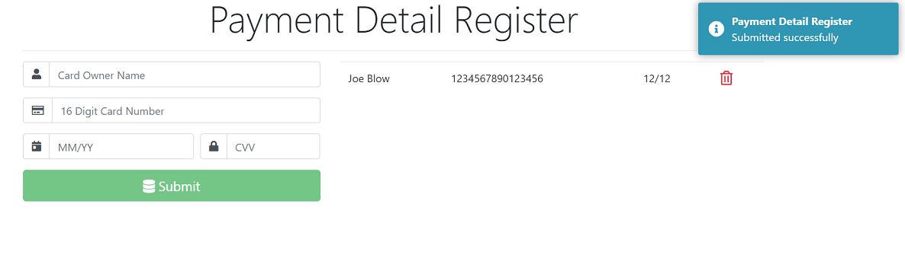
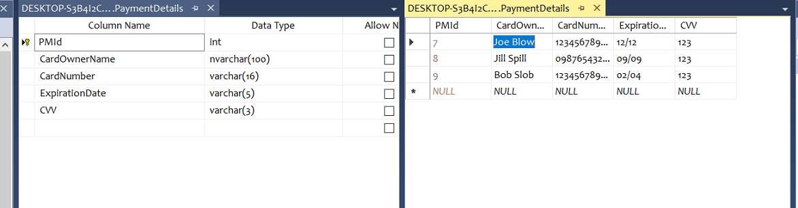
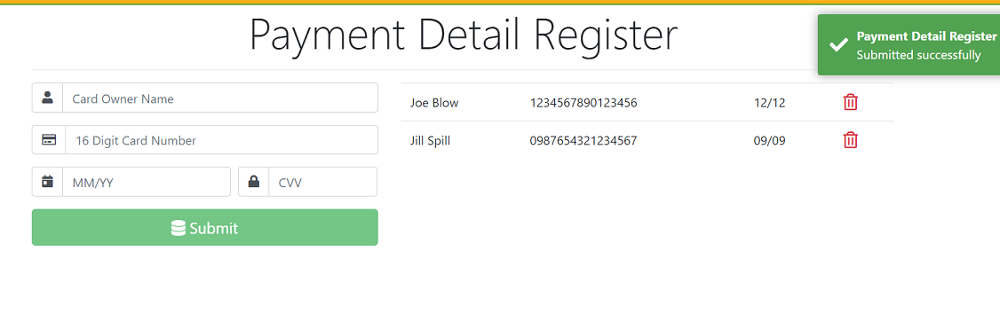
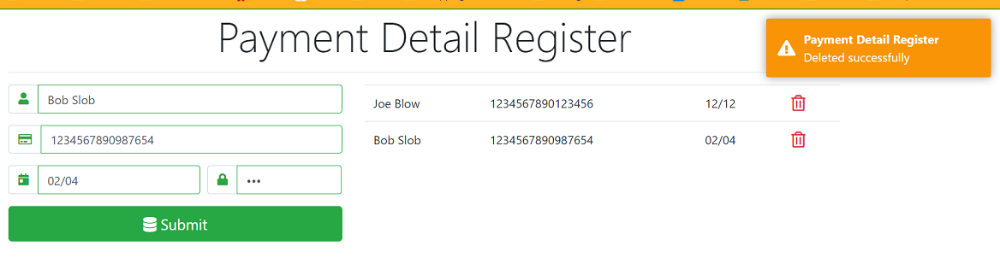
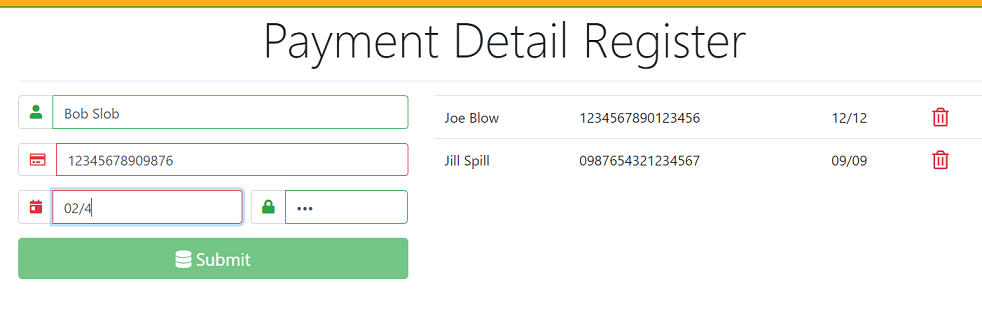

# WebAPI

## Introduction

This is a simple web application that takes in credit card information and performs CRUD operations on it. I've never used WebAPI, ASP.NET Core, or Angular 10, worked with either of these, so I thought I would give it a try. The project also utilizes JSON and SQLServer.

## WebAPI

The first element in this project is the WebAPI application build in VS. For this I created a model, PaymentDetail, along with a corresponding PaymentDetailContext class in Entity Framework. The program creates a SQL database, and uses CORS functionality to allow it to take data from the Angular program.

## Angular 10

The Angular program displays the web page which consists of an html form and a display of the database entries. The styling is Bootstrap, with FontAwesome icons, and Toastr messaging.

